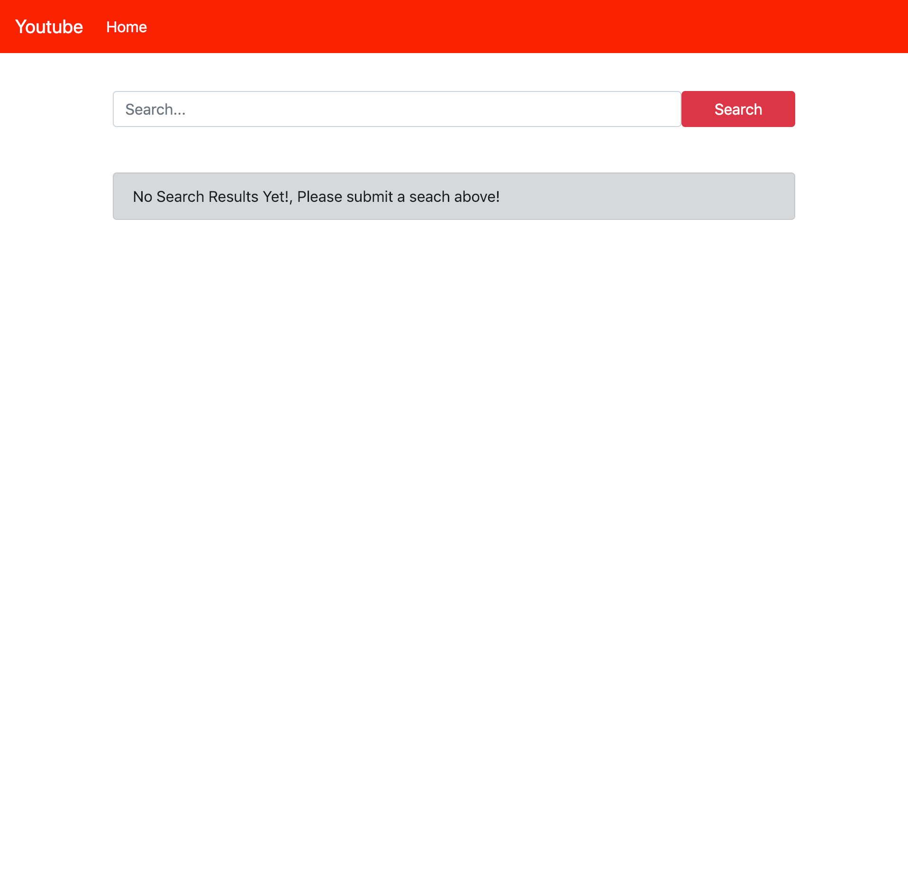
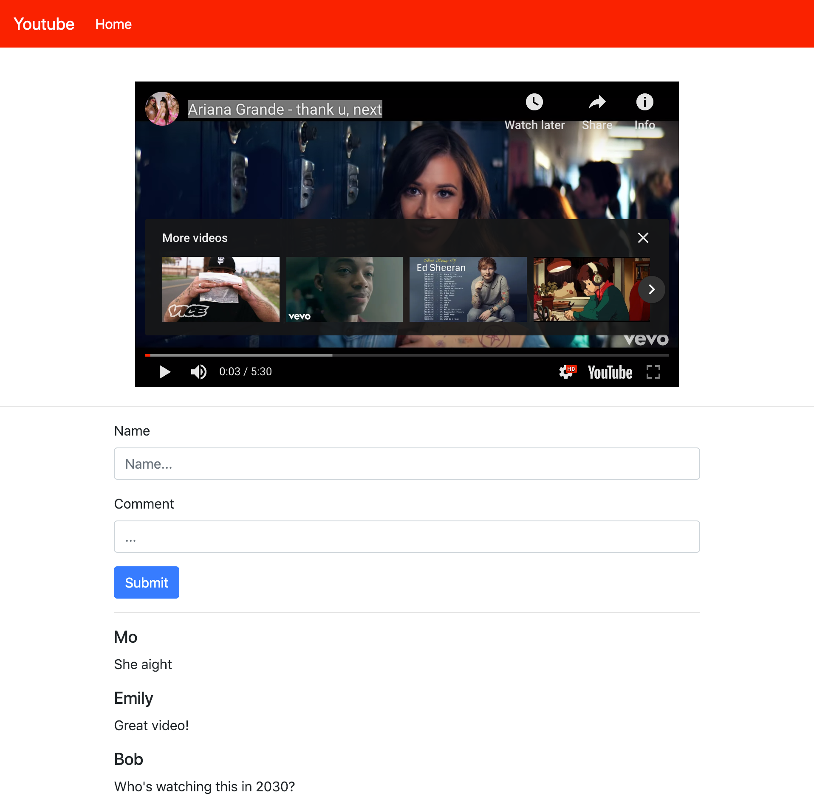

# Unit 4 Assessment

## Task

- Create a SPA with two pages
- You will use the official Youtube Data API v3
  - https://developers.google.com/youtube/v3/docs/
- Your app must make use of React Router v4
- Your app may NOT use any other dependencies other than the following:
  - Axios
  - React-Router-Dom
  - Bootstrap
    - Or equivalent UI frameworks like SemanticUI / Reactstrap
- Create-React-App
- Using any thing else will mean your submission is incomplete

## Required Featues

### Header (Logo and Links)

- Should be on EVERY page of the application
- Shows a logo (In this case says Youtube)
- Shows link to the following:
  - Home
- Should be a somewhat styled but not important
- Links should work and take you to Home page

### Homepage (No Search Results, Default): `/`

- Shows Header
- Shows a Search Input Field
- Shows a Search Button
- Originally when the user opens up the application there should be no search results
- It **NEEDS** to say the No Search Results message in place of where the search results would be
- Once user enters a new search, they can press `Search` to dynamically display results

### Homepage (Search Results): `/`

- Once a user presses `Search` it should replace the original "No search results" message with the results
- The results **MUST** me ordered in columns with **TWO** results per row
- For each video / result:
  - You must display the thumbnail image
  - You must display the title of the video
- Each video / result must be clickable
- Clicking on the video should take you to the Video page
- No pagination is needed for the search results, just display first 8 results

### Video Page: `/video/:id`

- You should be able to access this page by any link to the specfic video id
- Shows the youtube player to show that specific youtube video
- Has a form below the video:
  - Name input
  - Comment input
  - Submt button
- Adding a new comment in the form and pressing submit should add the comment to the list of comments
- **NO YOU DON'T NEED LOCALSTORAGE.**
  - That means if you refresh the page, all the comments should dissapear and that is OKAY.
  - All your comments should just be stored in state for the moment
- List the comments from newest to earliest
- Form should check to see if you entered both name AND comment, then allow you to post the comment
  - Else, it should return an alert saying to fill everything out

## Rubric

